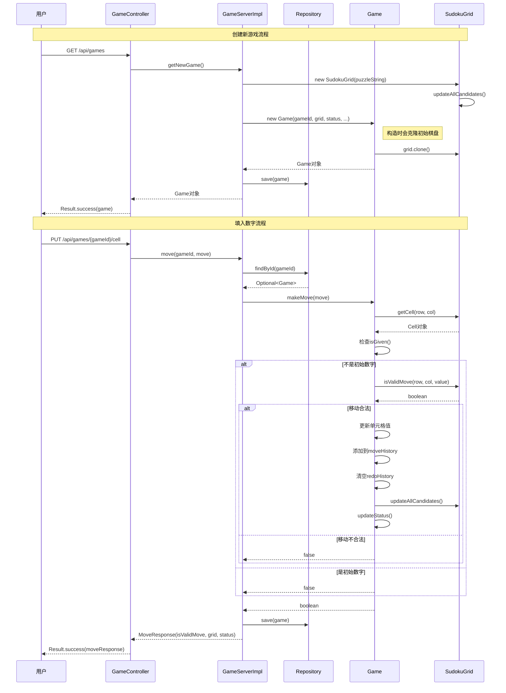

# 数独游戏系统 - 序列图：创建游戏和填入数字

## 序列图说明
本图展示了数独游戏系统中创建新游戏和填入数字的完整交互流程。

## 流程说明

### 创建新游戏流程
1. **用户请求**: 用户发送GET请求到`/api/games`
2. **控制器处理**: GameController调用GameServer创建新游戏
3. **棋盘初始化**: 根据谜题字符串创建SudokuGrid，并计算候选数
4. **游戏对象创建**: 创建Game对象，包括克隆初始棋盘状态
5. **数据持久化**: 将游戏保存到Repository
6. **响应返回**: 返回创建的游戏对象给用户

### 填入数字流程
1. **用户操作**: 用户发送PUT请求提交移动
2. **游戏查找**: 从Repository获取指定游戏
3. **移动验证**: 检查是否为初始数字，验证移动合法性
4. **状态更新**: 如果合法，更新棋盘、历史记录和游戏状态
5. **数据保存**: 保存更新后的游戏状态
6. **结果返回**: 返回移动结果给用户

## 关键点说明
- Game对象在创建时会克隆初始棋盘，用于重置功能
- 移动验证包括检查是否为初始给定数字和数独规则验证
- 每次有效移动都会更新候选数和游戏状态
- 使用栈结构管理撤销/重做历史记录 