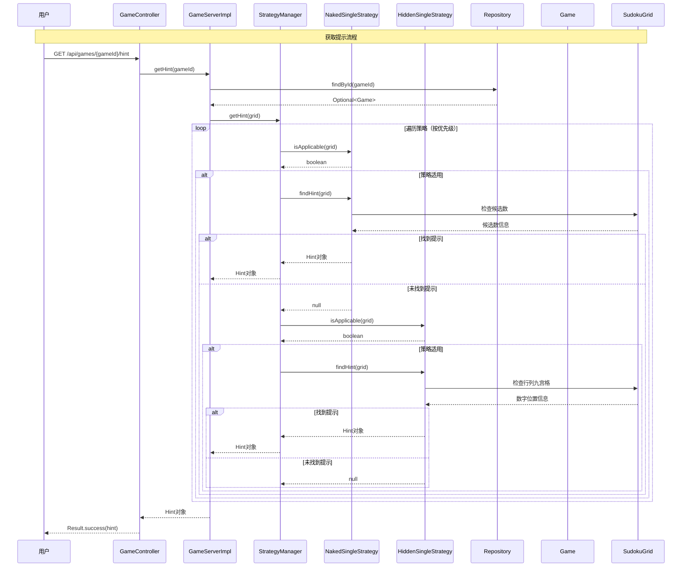

# 数独游戏系统 - 序列图：获取提示

## 序列图说明
本图展示了数独游戏系统中获取智能提示的完整交互流程，包括策略模式的应用。

## 流程说明

### 获取提示流程
1. **用户请求**: 用户发送GET请求到`/api/games/{gameId}/hint`
2. **游戏查找**: 从Repository获取指定游戏
3. **策略管理**: StrategyManager按优先级遍历所有策略
4. **策略应用**: 每个策略检查是否适用于当前棋盘状态
5. **提示生成**: 适用的策略分析棋盘并生成提示
6. **结果返回**: 返回找到的提示给用户

### 策略优先级
1. **NakedSingleStrategy (优先级1)**: 显性唯一策略
   - 检查只有一个候选数的单元格
   - 优先级最高，最先被应用

2. **HiddenSingleStrategy (优先级2)**: 隐性唯一策略
   - 检查在行、列、九宫格中只有一个位置的数字
   - 次高优先级

### 策略工作方式
- **显性唯一**: 查找候选数只有一个的单元格
- **隐性唯一**: 查找在特定区域中只有一个可能位置的数字
- **扩展性**: 可以轻松添加更多策略（如裸对、隐对等）

## 关键点说明
- 使用策略模式实现不同的解题算法
- 策略按优先级顺序执行，找到第一个有效提示就返回
- 每个策略都有独立的适用性检查和提示生成逻辑
- 提示包含策略名称、描述、相关单元格和建议移动 