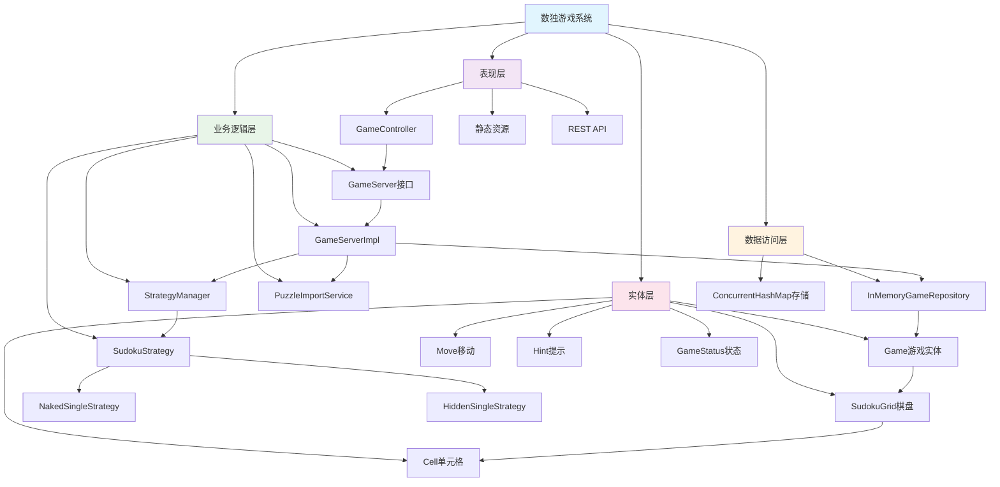

# 数独游戏系统 - 架构图

## 架构图说明
本图展示了数独游戏系统的分层架构设计，包括各层的主要组件和职责。

## 架构说明

### 分层架构
系统采用经典的四层架构设计：

#### 1. 表现层 (Presentation Layer)
- **GameController**: REST控制器，处理HTTP请求和响应
- **静态资源**: HTML、CSS、JavaScript前端文件
- **REST API**: 提供标准的RESTful接口

**职责**:
- 接收和处理用户请求
- 数据格式转换和验证
- 返回标准化的响应

#### 2. 业务逻辑层 (Business Logic Layer)
- **GameServer**: 游戏服务接口，定义业务操作
- **GameServerImpl**: 游戏服务实现，包含核心业务逻辑
- **StrategyManager**: 策略管理器，管理解题策略
- **SudokuStrategy**: 策略接口及其实现
- **PuzzleImportService**: 谜题导入服务

**职责**:
- 实现核心业务逻辑
- 游戏规则验证
- 策略模式应用
- 业务流程控制

#### 3. 数据访问层 (Data Access Layer)
- **InMemoryGameRepository**: 内存数据仓储
- **ConcurrentHashMap**: 线程安全的数据存储

**职责**:
- 数据持久化管理
- 数据访问抽象
- 并发安全保证

#### 4. 实体层 (Entity Layer)
- **Game**: 游戏主实体
- **SudokuGrid**: 数独棋盘
- **Cell**: 单元格
- **Move**: 移动操作
- **Hint**: 提示信息
- **GameStatus**: 游戏状态

**职责**:
- 定义核心业务对象
- 封装数据和行为
- 实现业务规则

## 设计原则

### 1. 单一职责原则
每个类都有明确的职责，如GameController只负责HTTP请求处理，GameServerImpl只负责业务逻辑。

### 2. 依赖倒置原则
高层模块不依赖低层模块，都依赖抽象。如GameController依赖GameServer接口而非具体实现。

### 3. 开闭原则
系统对扩展开放，对修改关闭。策略模式的应用使得添加新的解题策略变得容易。

### 4. 接口隔离原则
定义了清晰的接口，如GameServer接口只包含游戏相关的操作。

## 关键特性

### 1. 可扩展性
- 策略模式支持添加新的解题算法
- 分层架构便于添加新功能

### 2. 可维护性
- 清晰的职责分离
- 标准的分层结构

### 3. 可测试性
- 接口抽象便于单元测试
- 依赖注入支持模拟对象

### 4. 并发安全
- 使用ConcurrentHashMap保证线程安全
- 无状态的服务层设计 