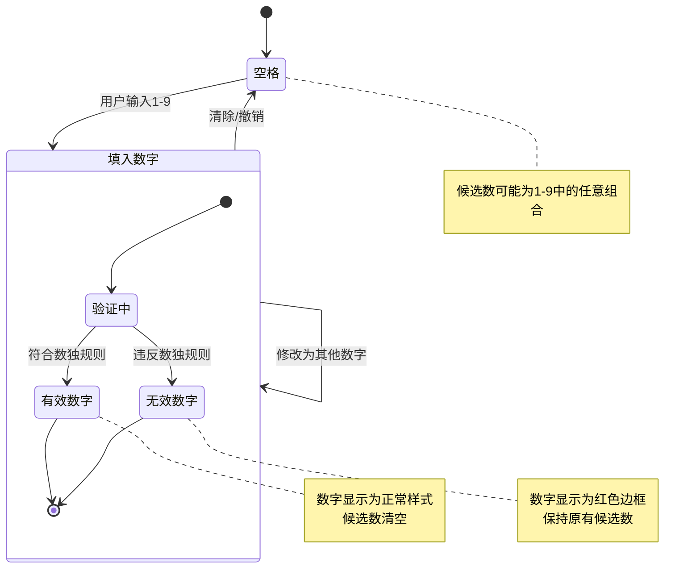

# 数独游戏系统 - 状态图：单元格状态

## 状态图说明
本图展示了数独游戏中单个单元格的状态转换，包括空格、有效数字和无效数字的转换。

## 状态说明

### 主要状态
1. **空格**: 单元格为空，可能包含候选数
2. **填入数字**: 单元格包含用户输入的数字
   - **有效数字**: 符合数独规则的数字
   - **无效数字**: 违反数独规则的数字

### 状态转换
- **用户输入**: 从空格转换到填入数字状态
- **清除操作**: 从填入数字回到空格状态
- **撤销操作**: 可能从任何状态回到之前的状态
- **修改数字**: 在填入数字状态内部转换

### 验证过程
每次填入数字时都会进行验证：
- **行验证**: 检查同行是否有相同数字
- **列验证**: 检查同列是否有相同数字
- **九宫格验证**: 检查同九宫格是否有相同数字

## 视觉表现
- **空格**: 显示候选数（小数字）
- **有效数字**: 正常显示，候选数清空
- **无效数字**: 红色边框显示，保持候选数

## 候选数管理
- **空格状态**: 自动计算并显示所有可能的候选数
- **有效数字**: 候选数被清空
- **无效数字**: 保持原有候选数，允许用户看到可能的选择

## 关键特性
- **实时验证**: 每次输入都会立即验证
- **视觉反馈**: 通过颜色区分有效和无效输入
- **候选数辅助**: 帮助用户做出正确选择
- **可恢复性**: 支持撤销和修改操作 