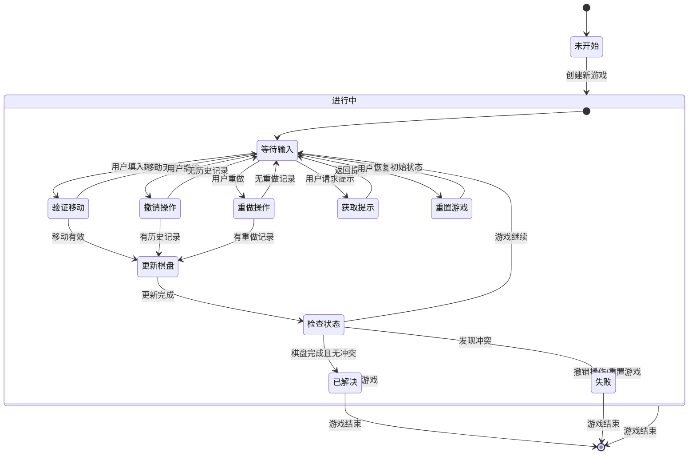

# 数独游戏系统 - 状态图：游戏状态

## 状态图说明
本图展示了数独游戏的完整状态转换流程，包括游戏的主要状态和转换条件。

## 状态说明

### 主要状态
1. **未开始**: 游戏尚未创建
2. **进行中**: 游戏正在进行，包含多个子状态
3. **已解决**: 数独已成功完成
4. **失败**: 游戏中出现冲突

### 进行中的子状态
- **等待输入**: 系统等待用户操作
- **验证移动**: 检查用户输入的移动是否合法
- **更新棋盘**: 应用有效的移动到棋盘
- **检查状态**: 判断游戏是否结束
- **撤销操作**: 处理撤销请求
- **重做操作**: 处理重做请求
- **获取提示**: 生成并返回提示
- **重置游戏**: 恢复到初始状态

### 状态转换条件
- **创建新游戏**: 从未开始到进行中
- **移动有效/无效**: 决定是否更新棋盘
- **棋盘完成且无冲突**: 转换到已解决状态
- **发现冲突**: 转换到失败状态
- **重置游戏**: 从任何状态回到进行中
- **撤销操作**: 可能从失败状态回到进行中

## 关键特性
- **可恢复性**: 失败状态可以通过撤销或重置恢复
- **历史管理**: 支持撤销和重做操作
- **状态检查**: 每次移动后都会检查游戏状态
- **多路径**: 多种方式可以改变游戏状态 