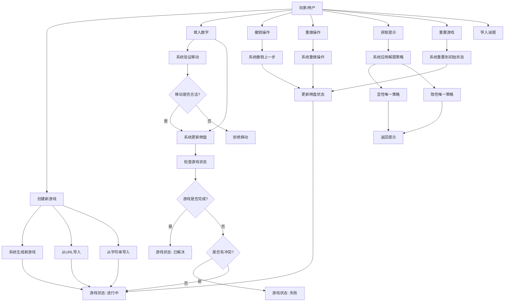

# 数独游戏系统 - 用例图

## 用例图说明
本图展示了数独游戏系统的主要用例和用户交互流程。

## 主要用例说明

### 基本用例
1. **创建新游戏** - 用户开始一个新的数独游戏 (GET /api/games)
2. **填入数字** - 用户在空格中填入1-9的数字 (PUT /api/games/{gameId}/cell)
3. **撤销操作** - 用户撤销上一步操作 (POST /api/games/{gameId}/undo)
4. **重做操作** - 用户重做被撤销的操作 (POST /api/games/{gameId}/redo)
5. **获取提示** - 用户请求系统提供解题提示 (GET /api/games/{gameId}/hint)
6. **重置游戏** - 用户将游戏重置到初始状态 (POST /api/games/{gameId}/reset)
7. **导入谜题** - 用户从外部源导入自定义谜题
   - 从URL导入 (POST /api/games/import-url)
   - 从字符串导入 (POST /api/games/import-string)

### 系统响应
- 游戏状态管理（进行中、已解决、失败）
- 移动验证和棋盘更新
- 智能提示策略应用
- 历史记录管理 