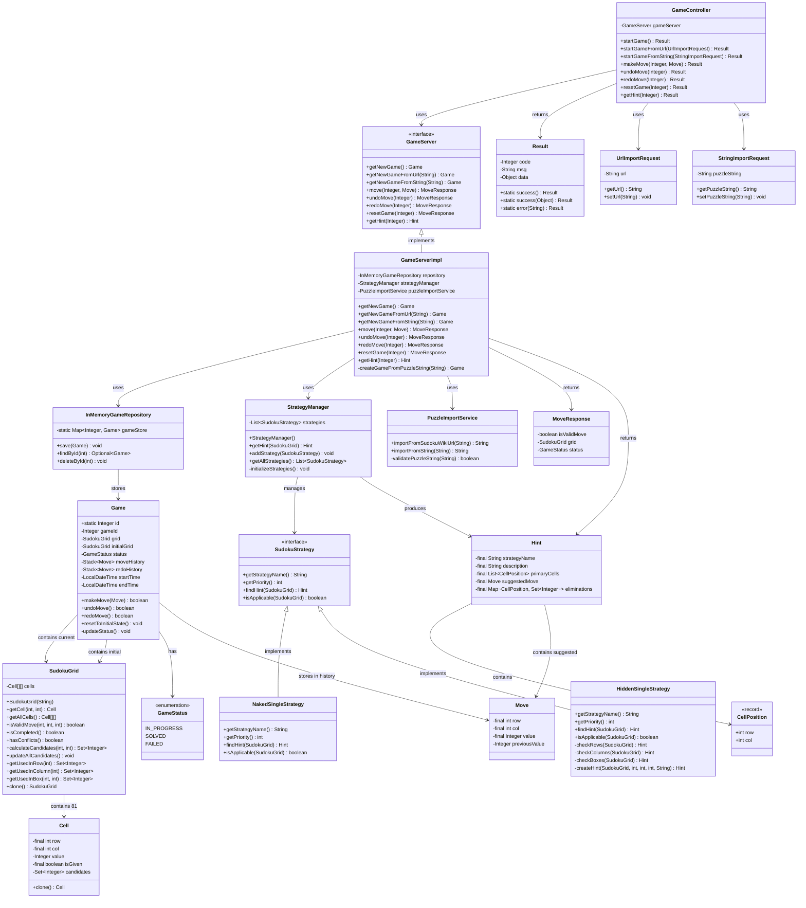

# 数独游戏系统 - 类图

## 类图说明
本图展示了数独游戏系统的完整类结构和关系，包括实体类、控制器、服务层、数据访问层等。

## 类的职责说明

### 核心实体类
- **Game**: 游戏主实体，管理游戏状态和历史记录
- **SudokuGrid**: 9x9数独棋盘，包含81个单元格
- **Cell**: 单元格实体，存储位置、值和候选数
- **Move**: 移动操作实体，记录操作详情

### 控制层
- **GameController**: REST控制器，处理HTTP请求

### 服务层
- **GameServer**: 游戏服务接口
- **GameServerImpl**: 游戏服务实现
- **StrategyManager**: 策略管理器
- **PuzzleImportService**: 谜题导入服务

### 数据访问层
- **InMemoryGameRepository**: 内存游戏仓储

### 策略模式实现
- **SudokuStrategy**: 策略接口
- **NakedSingleStrategy**: 显性唯一策略
- **HiddenSingleStrategy**: 隐性唯一策略 