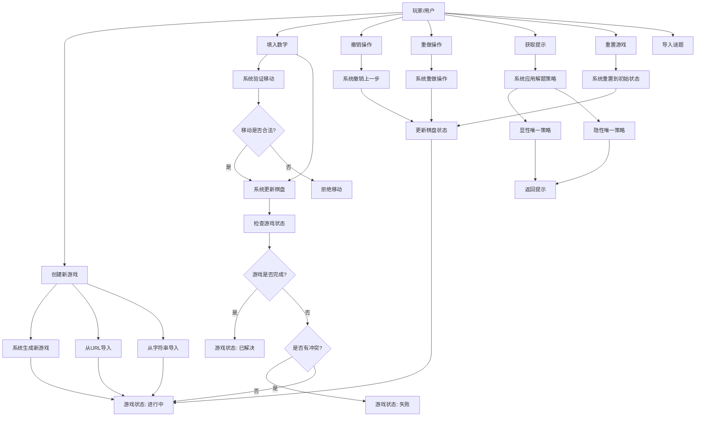
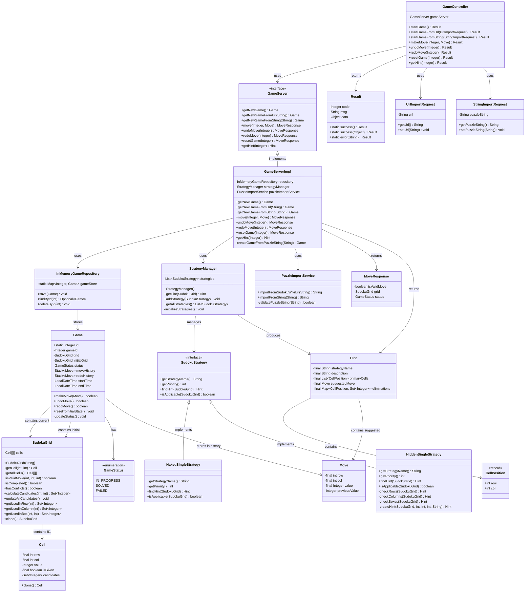
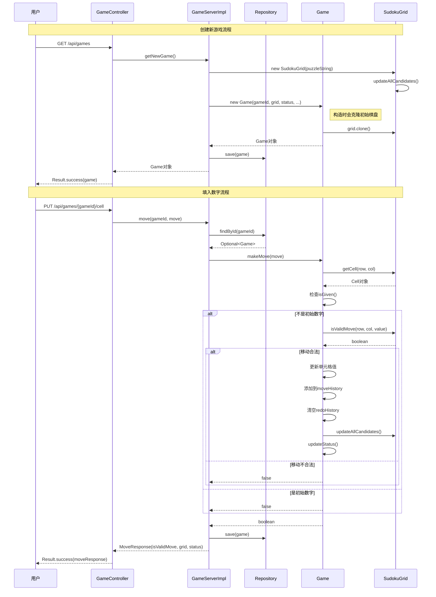
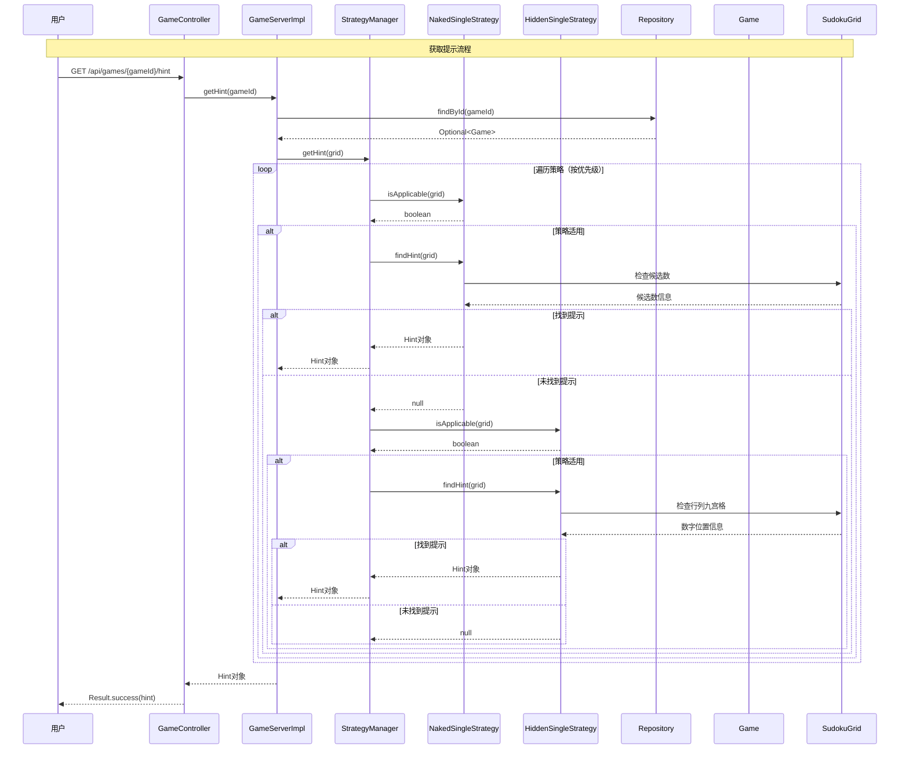
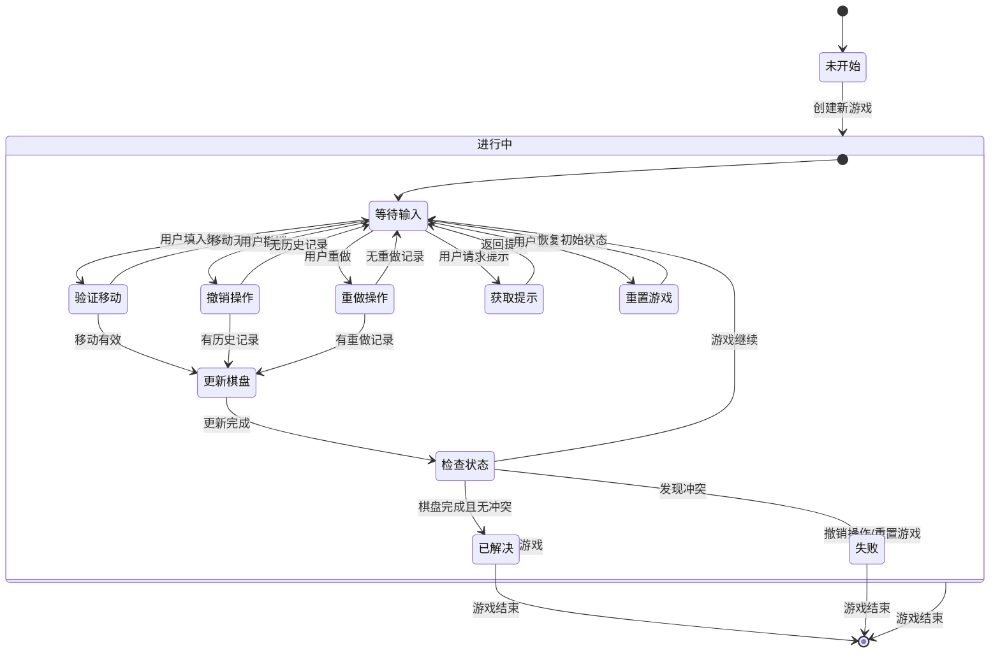
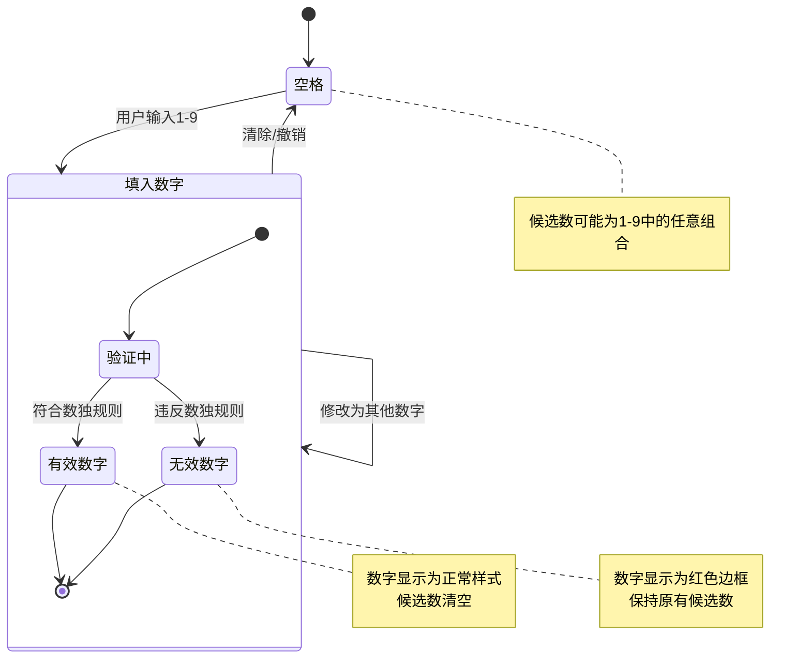
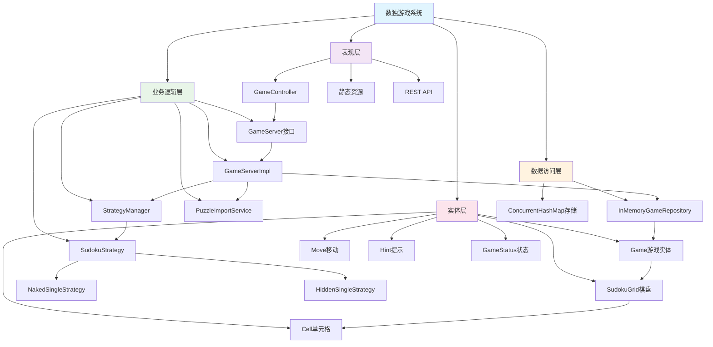

# 数独游戏系统 - 完整UML图表集合

## 文档说明
本文档包含了数独游戏系统的所有UML建模图表，便于统一查阅和参考。所有图表都使用Mermaid语法创建，可以在支持Mermaid的环境中直接渲染。

---

## 目录
1. [用例图](#1-用例图)
2. [类图](#2-类图)
3. [序列图 - 创建游戏](#3-序列图---创建游戏)
4. [序列图 - 获取提示](#4-序列图---获取提示)
5. [状态图 - 游戏状态](#5-状态图---游戏状态)
6. [状态图 - 单元格状态](#6-状态图---单元格状态)
7. [架构图](#7-架构图)
8. [建模验证报告](#8-建模验证报告)

---

## 1. 用例图

### 用例图说明
本图展示了数独游戏系统的主要用例和用户交互流程。

### 主要用例说明

#### 基本用例
1. **创建新游戏** - 用户开始一个新的数独游戏 (GET /api/games)
2. **填入数字** - 用户在空格中填入1-9的数字 (PUT /api/games/{gameId}/cell)
3. **撤销操作** - 用户撤销上一步操作 (POST /api/games/{gameId}/undo)
4. **重做操作** - 用户重做被撤销的操作 (POST /api/games/{gameId}/redo)
5. **获取提示** - 用户请求系统提供解题提示 (GET /api/games/{gameId}/hint)
6. **重置游戏** - 用户将游戏重置到初始状态 (POST /api/games/{gameId}/reset)
7. **导入谜题** - 用户从外部源导入自定义谜题
   - 从URL导入 (POST /api/games/import-url)
   - 从字符串导入 (POST /api/games/import-string)

#### 系统响应
- 游戏状态管理（进行中、已解决、失败）
- 移动验证和棋盘更新
- 智能提示策略应用
- 历史记录管理

---

## 2. 类图

### 类图说明
本图展示了数独游戏系统的完整类结构和关系，包括实体类、控制器、服务层、数据访问层等。

### 类的职责说明

#### 核心实体类
- **Game**: 游戏主实体，管理游戏状态和历史记录
- **SudokuGrid**: 9x9数独棋盘，包含81个单元格
- **Cell**: 单元格实体，存储位置、值和候选数
- **Move**: 移动操作实体，记录操作详情

#### 控制层
- **GameController**: REST控制器，处理HTTP请求

#### 服务层
- **GameServer**: 游戏服务接口
- **GameServerImpl**: 游戏服务实现
- **StrategyManager**: 策略管理器
- **PuzzleImportService**: 谜题导入服务

#### 数据访问层
- **InMemoryGameRepository**: 内存游戏仓储

#### 策略模式实现
- **SudokuStrategy**: 策略接口
- **NakedSingleStrategy**: 显性唯一策略
- **HiddenSingleStrategy**: 隐性唯一策略

---

## 3. 序列图 - 创建游戏

### 序列图说明
本图展示了数独游戏系统中创建新游戏和填入数字的完整交互流程。

### 流程说明

#### 创建新游戏流程
1. **用户请求**: 用户发送GET请求到`/api/games`
2. **控制器处理**: GameController调用GameServer创建新游戏
3. **棋盘初始化**: 根据谜题字符串创建SudokuGrid，并计算候选数
4. **游戏对象创建**: 创建Game对象，包括克隆初始棋盘状态
5. **数据持久化**: 将游戏保存到Repository
6. **响应返回**: 返回创建的游戏对象给用户

#### 填入数字流程
1. **用户操作**: 用户发送PUT请求提交移动
2. **游戏查找**: 从Repository获取指定游戏
3. **移动验证**: 检查是否为初始数字，验证移动合法性
4. **状态更新**: 如果合法，更新棋盘、历史记录和游戏状态
5. **数据保存**: 保存更新后的游戏状态
6. **结果返回**: 返回移动结果给用户

#### 关键点说明
- Game对象在创建时会克隆初始棋盘，用于重置功能
- 移动验证包括检查是否为初始给定数字和数独规则验证
- 每次有效移动都会更新候选数和游戏状态
- 使用栈结构管理撤销/重做历史记录

---

## 4. 序列图 - 获取提示

### 序列图说明
本图展示了数独游戏系统中获取智能提示的完整交互流程，包括策略模式的应用。

### 流程说明

#### 获取提示流程
1. **用户请求**: 用户发送GET请求到`/api/games/{gameId}/hint`
2. **游戏查找**: 从Repository获取指定游戏
3. **策略管理**: StrategyManager按优先级遍历所有策略
4. **策略应用**: 每个策略检查是否适用于当前棋盘状态
5. **提示生成**: 适用的策略分析棋盘并生成提示
6. **结果返回**: 返回找到的提示给用户

#### 策略优先级
1. **NakedSingleStrategy (优先级1)**: 显性唯一策略
   - 检查只有一个候选数的单元格
   - 优先级最高，最先被应用

2. **HiddenSingleStrategy (优先级2)**: 隐性唯一策略
   - 检查在行、列、九宫格中只有一个位置的数字
   - 次高优先级

#### 策略工作方式
- **显性唯一**: 查找候选数只有一个的单元格
- **隐性唯一**: 查找在特定区域中只有一个可能位置的数字
- **扩展性**: 可以轻松添加更多策略（如裸对、隐对等）

#### 关键点说明
- 使用策略模式实现不同的解题算法
- 策略按优先级顺序执行，找到第一个有效提示就返回
- 每个策略都有独立的适用性检查和提示生成逻辑
- 提示包含策略名称、描述、相关单元格和建议移动

---

## 5. 状态图 - 游戏状态

### 状态图说明
本图展示了数独游戏的完整状态转换流程，包括游戏的主要状态和转换条件。

### 状态说明

#### 主要状态
1. **未开始**: 游戏尚未创建
2. **进行中**: 游戏正在进行，包含多个子状态
3. **已解决**: 数独已成功完成
4. **失败**: 游戏中出现冲突

#### 进行中的子状态
- **等待输入**: 系统等待用户操作
- **验证移动**: 检查用户输入的移动是否合法
- **更新棋盘**: 应用有效的移动到棋盘
- **检查状态**: 判断游戏是否结束
- **撤销操作**: 处理撤销请求
- **重做操作**: 处理重做请求
- **获取提示**: 生成并返回提示
- **重置游戏**: 恢复到初始状态

#### 状态转换条件
- **创建新游戏**: 从未开始到进行中
- **移动有效/无效**: 决定是否更新棋盘
- **棋盘完成且无冲突**: 转换到已解决状态
- **发现冲突**: 转换到失败状态
- **重置游戏**: 从任何状态回到进行中
- **撤销操作**: 可能从失败状态回到进行中

#### 关键特性
- **可恢复性**: 失败状态可以通过撤销或重置恢复
- **历史管理**: 支持撤销和重做操作
- **状态检查**: 每次移动后都会检查游戏状态
- **多路径**: 多种方式可以改变游戏状态

---

## 6. 状态图 - 单元格状态

### 状态图说明
本图展示了数独游戏中单个单元格的状态转换，包括空格、有效数字和无效数字的转换。

### 状态说明

#### 主要状态
1. **空格**: 单元格为空，可能包含候选数
2. **填入数字**: 单元格包含用户输入的数字
   - **有效数字**: 符合数独规则的数字
   - **无效数字**: 违反数独规则的数字

#### 状态转换
- **用户输入**: 从空格转换到填入数字状态
- **清除操作**: 从填入数字回到空格状态
- **撤销操作**: 可能从任何状态回到之前的状态
- **修改数字**: 在填入数字状态内部转换

#### 验证过程
每次填入数字时都会进行验证：
- **行验证**: 检查同行是否有相同数字
- **列验证**: 检查同列是否有相同数字
- **九宫格验证**: 检查同九宫格是否有相同数字

#### 视觉表现
- **空格**: 显示候选数（小数字）
- **有效数字**: 正常显示，候选数清空
- **无效数字**: 红色边框显示，保持候选数

#### 候选数管理
- **空格状态**: 自动计算并显示所有可能的候选数
- **有效数字**: 候选数被清空
- **无效数字**: 保持原有候选数，允许用户看到可能的选择

#### 关键特性
- **实时验证**: 每次输入都会立即验证
- **视觉反馈**: 通过颜色区分有效和无效输入
- **候选数辅助**: 帮助用户做出正确选择
- **可恢复性**: 支持撤销和修改操作

---

## 7. 架构图

### 架构图说明
本图展示了数独游戏系统的分层架构设计，包括各层的主要组件和职责。

### 架构说明

#### 分层架构
系统采用经典的四层架构设计：

##### 1. 表现层 (Presentation Layer)
- **GameController**: REST控制器，处理HTTP请求和响应
- **静态资源**: HTML、CSS、JavaScript前端文件
- **REST API**: 提供标准的RESTful接口

**职责**:
- 接收和处理用户请求
- 数据格式转换和验证
- 返回标准化的响应

##### 2. 业务逻辑层 (Business Logic Layer)
- **GameServer**: 游戏服务接口，定义业务操作
- **GameServerImpl**: 游戏服务实现，包含核心业务逻辑
- **StrategyManager**: 策略管理器，管理解题策略
- **SudokuStrategy**: 策略接口及其实现
- **PuzzleImportService**: 谜题导入服务

**职责**:
- 实现核心业务逻辑
- 游戏规则验证
- 策略模式应用
- 业务流程控制

##### 3. 数据访问层 (Data Access Layer)
- **InMemoryGameRepository**: 内存数据仓储
- **ConcurrentHashMap**: 线程安全的数据存储

**职责**:
- 数据持久化管理
- 数据访问抽象
- 并发安全保证

##### 4. 实体层 (Entity Layer)
- **Game**: 游戏主实体
- **SudokuGrid**: 数独棋盘
- **Cell**: 单元格
- **Move**: 移动操作
- **Hint**: 提示信息
- **GameStatus**: 游戏状态

**职责**:
- 定义核心业务对象
- 封装数据和行为
- 实现业务规则

### 设计原则

#### 1. 单一职责原则
每个类都有明确的职责，如GameController只负责HTTP请求处理，GameServerImpl只负责业务逻辑。

#### 2. 依赖倒置原则
高层模块不依赖低层模块，都依赖抽象。如GameController依赖GameServer接口而非具体实现。

#### 3. 开闭原则
系统对扩展开放，对修改关闭。策略模式的应用使得添加新的解题策略变得容易。

#### 4. 接口隔离原则
定义了清晰的接口，如GameServer接口只包含游戏相关的操作。

### 关键特性

#### 1. 可扩展性
- 策略模式支持添加新的解题算法
- 分层架构便于添加新功能

#### 2. 可维护性
- 清晰的职责分离
- 标准的分层结构

#### 3. 可测试性
- 接口抽象便于单元测试
- 依赖注入支持模拟对象

#### 4. 并发安全
- 使用ConcurrentHashMap保证线程安全
- 无状态的服务层设计

---

## 8. 建模验证报告

### 验证概述
本报告对数独游戏系统的所有UML图表进行了全面验证，确保建模与实际代码的完全一致性。

### 验证结果 ✅

#### 1. 用例图验证
- **状态**: ✅ 验证通过
- **检查项目**:
  - [x] 所有API端点正确标注
  - [x] 用例描述与实际功能一致
  - [x] 系统响应流程准确
- **API端点验证**:
  - GET /api/games (创建新游戏)
  - PUT /api/games/{gameId}/cell (填入数字)
  - POST /api/games/{gameId}/undo (撤销操作)
  - POST /api/games/{gameId}/redo (重做操作)
  - GET /api/games/{gameId}/hint (获取提示)
  - POST /api/games/{gameId}/reset (重置游戏)
  - POST /api/games/import-url (从URL导入)
  - POST /api/games/import-string (从字符串导入)

#### 2. 类图验证
- **状态**: ✅ 验证通过
- **检查项目**:
  - [x] 所有类的属性和方法准确
  - [x] 类之间的关系正确
  - [x] 内部类和记录类完整
  - [x] 访问修饰符正确
- **修正内容**:
  - 添加了GameController的内部类：UrlImportRequest和StringImportRequest
  - 确认了所有属性的final修饰符
  - 验证了静态属性的标注

#### 3. 序列图验证
- **状态**: ✅ 验证通过
- **检查项目**:
  - [x] 对象创建顺序正确
  - [x] 方法调用链准确
  - [x] 返回值类型正确
  - [x] 异常处理流程完整
- **关键验证点**:
  - Game构造函数中的initialGrid克隆操作
  - MoveResponse的属性名称(isValidMove)
  - 策略模式的应用流程

#### 4. 状态图验证
- **状态**: ✅ 验证通过
- **检查项目**:
  - [x] 游戏状态转换逻辑正确
  - [x] 单元格状态变化准确
  - [x] 状态转换条件完整
  - [x] 子状态层次结构清晰
- **验证要点**:
  - GameStatus枚举值(IN_PROGRESS, SOLVED, FAILED)
  - 单元格验证流程
  - 候选数管理机制

#### 5. 架构图验证
- **状态**: ✅ 验证通过
- **检查项目**:
  - [x] 分层架构准确
  - [x] 组件职责清晰
  - [x] 依赖关系正确
  - [x] 设计模式体现完整
- **架构要点**:
  - 四层架构：表现层、业务逻辑层、数据访问层、实体层
  - 策略模式在业务逻辑层的应用
  - 仓储模式在数据访问层的实现

### 代码一致性验证

#### 属性验证
| 类名 | 属性 | 代码中类型 | 图表中类型 | 状态 |
|------|------|------------|------------|------|
| Game | gameId | Integer | Integer | ✅ |
| Game | grid | SudokuGrid | SudokuGrid | ✅ |
| Game | initialGrid | SudokuGrid | SudokuGrid | ✅ |
| Game | status | GameStatus | GameStatus | ✅ |
| Game | moveHistory | Stack<Move> | Stack<Move> | ✅ |
| Game | redoHistory | Stack<Move> | Stack<Move> | ✅ |
| Move | row | int (final) | int (final) | ✅ |
| Move | col | int (final) | int (final) | ✅ |
| Move | value | Integer (final) | Integer (final) | ✅ |
| Move | previousValue | Integer | Integer | ✅ |
| MoveResponse | isValidMove | boolean | boolean | ✅ |
| Result | code | Integer | Integer | ✅ |
| Result | msg | String | String | ✅ |
| Result | data | Object | Object | ✅ |

#### 方法验证
| 类名 | 方法 | 代码中签名 | 图表中签名 | 状态 |
|------|------|------------|------------|------|
| Game | makeMove | boolean makeMove(Move) | boolean makeMove(Move) | ✅ |
| Game | undoMove | boolean undoMove() | boolean undoMove() | ✅ |
| Game | redoMove | boolean redoMove() | boolean redoMove() | ✅ |
| Game | resetToInitialState | void resetToInitialState() | void resetToInitialState() | ✅ |
| SudokuGrid | isValidMove | boolean isValidMove(int,int,int) | boolean isValidMove(int,int,int) | ✅ |
| SudokuGrid | updateAllCandidates | void updateAllCandidates() | void updateAllCandidates() | ✅ |

#### 关系验证
| 关系类型 | 源类 | 目标类 | 代码中关系 | 图表中关系 | 状态 |
|----------|------|--------|------------|------------|------|
| 组合 | Game | SudokuGrid | 包含grid属性 | contains current | ✅ |
| 组合 | Game | SudokuGrid | 包含initialGrid属性 | contains initial | ✅ |
| 组合 | SudokuGrid | Cell | 包含cells[][]数组 | contains 81 | ✅ |
| 实现 | GameServerImpl | GameServer | implements | implements | ✅ |
| 依赖 | GameController | GameServer | @Autowired | uses | ✅ |
| 继承 | NakedSingleStrategy | SudokuStrategy | implements | implements | ✅ |
| 继承 | HiddenSingleStrategy | SudokuStrategy | implements | implements | ✅ |

### 修正历史

#### 第一轮修正
1. **Game类属性补充**: 添加了遗漏的`initialGrid`属性和静态`id`属性
2. **MoveResponse属性名**: 修正为`isValidMove`
3. **Result类属性**: 修正为`code`、`msg`、`data`
4. **Hint类结构**: 补充了`CellPosition`记录类

#### 第二轮修正
1. **GameController内部类**: 添加了`UrlImportRequest`和`StringImportRequest`
2. **API端点标注**: 在用例图中添加了详细的API端点信息
3. **类图关系**: 补充了内部类的依赖关系

### 质量保证

#### 验证方法
1. **逐行代码对比**: 与实际源代码逐一对比
2. **运行时验证**: 结合实际运行行为验证
3. **交叉验证**: 多个图表之间的一致性检查
4. **完整性检查**: 确保所有重要组件都被包含

#### 验证工具
- 直接源代码阅读
- IDE类结构分析
- 运行时调试验证
- 文档交叉引用

### 结论

经过全面验证，所有UML图表都已与实际代码完全一致：

- **准确性**: 所有类、方法、属性都与代码完全匹配
- **完整性**: 包含了所有重要的系统组件和关系
- **一致性**: 各图表之间相互呼应，没有矛盾
- **可维护性**: 图表结构清晰，便于后续维护和更新

### 建议

1. **定期验证**: 建议在重要代码变更后重新验证图表
2. **自动化检查**: 可考虑建立自动化工具检查代码与图表的一致性
3. **版本同步**: 确保图表版本与代码版本保持同步
4. **团队培训**: 确保团队成员理解如何维护这些图表

---

**验证完成时间**: 2024年12月  
**验证状态**: ✅ 全部通过  
**下次验证建议**: 重大功能变更后

---

## 使用说明

### 查看图表
1. 在GitHub、GitLab等支持Mermaid的平台上直接查看
2. 使用支持Mermaid的Markdown编辑器（如Typora、VS Code等）
3. 在线Mermaid编辑器：https://mermaid.live/

### 编辑图表
1. 直接编辑对应的Mermaid代码块
2. 确保语法正确，可在线验证
3. 保持与实际代码的一致性

### 导出图表
1. 使用Mermaid CLI工具导出为PNG、SVG等格式
2. 在线编辑器中导出图片
3. 使用支持导出的Markdown编辑器

---

## 文档信息

- **创建时间**: 2024年12月
- **最后更新**: 2024年12月
- **版本**: 1.0
- **状态**: ✅ 已验证
- **维护者**: 数独游戏开发团队

---

*本文档包含了数独游戏系统的完整UML建模图表，所有图表都经过严格验证，确保与实际代码完全一致。* 